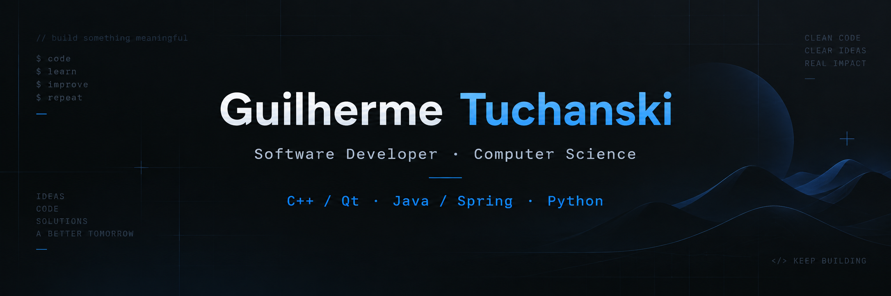

  

<h2 align="left">Hello there 👋</h2>

I'm <b>Guilherme</b>, a Software Developer and Computer Science undergraduate from Brazil.

I have experience in <b>desktop and web development, test automation, API integration, and software maintenance</b>.
Currently, I work as a <b>Software Development Intern at Siemens</b>, contributing to <b>Spectrum Power 7</b>, a SCADA platform for power grid management and optimization.

🎓 Computer Science — Pontifícia Universidade Católica do Paraná (PUCPR) 
⚡ Software Development Intern — Siemens

👉 Check out my portfolio:
<a href="https://tuchanski.com" target="_blank"><b>tuchanski.com</b></a>

📫 <b>Get in touch:</b>

